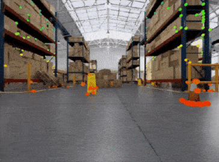
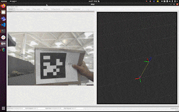

+++
title = 'Adventures with an Orin Nano'
date = '2024-05-25'
author = 'Ashwin Naren'
tags = ['software', 'coprocessor', 'rust', 'ros2']
summary = 'Our software team used an NVIDIA Orin Nano Developer Kit as a coprocessor with ROS 2 with an Intel RealSense Camera, and got it working.'
ShowReadingTime = true
+++

This season, our software team used
an [NVIDIA Orin Nano Developer Kit](https://www.nvidia.com/en-us/autonomous-machines/embedded-systems/jetson-orin/) as a
coprocessor with an attached [Intel RealSense camera](https://www.intelrealsense.com/).
This coprocessor allowed us to perform computationally intensive vision tasks,
such as VSLAM, object detection, and April Tags, in parallel with our main robot code running on the RoboRIO.

## Why an Orin Nano?

We were looking for a coprocessor that had a good GPU, for faster vision task performance.
Naturally, we looked at NVIDIA's processors due to NVIDIA's high-performance GPUs.
We are constricted by the $600 limit on robot parts, so we couldn't use a Jetson AGX Developer Kit ($2000-$3000).
We needed a developer kit to test our code
because we did not want to run the risk of deploying code on a processor that is not our testing processor
due to time and budget constraints.
So we did not consider non-developer kit options like the Jetson Orin NX series.
The Orin Nano Developer Kit was within the $600 limit, so it was chosen.
It has a 1024-core NVIDIA Ampere architecture GPU with 32 Tensor Cores,
which produces up to 40 TOPS (Tera Operations Per Second) of performance.
It also has a 6-core ARM Cortex-A78AE CPU, which is more than enough for our CPU work.
The Orin also has a decent 7–15 W power consumption, which ensures it does not drain our battery power too quickly.

## ROS 2

We used [ROS 2 (Robot Operating System 2)](https://www.ros.org/) to run the software on the Orin Nano.
ROS 2 is an architecture of sorts for writing robot software.
It consists of nodes, which are separate processes that communicate with each other via ROS 2's middleware.
There are three types of ways to communicate between nodes: topics, services, and actions.
Topics are a publish-subscribe system, where one node publishes data to multiple receivers.
Services are a request-response system, where one node requests data from another node.
Actions are a more complex version of services, where the request-response system is asynchronous and there are status
updates along the way.
For our project, we only used topics.
NVIDIA maintains a version of ROS 2 called [ISSAC ROS](https://developer.nvidia.com/isaac/ros),
which has some additional support for their GPUs.

To set it up, NVIDIA has published
a [guide to setup a developer environment](https://nvidia-isaac-ros.github.io/getting_started/dev_env_setup.html).

After setting up the environment, we had to create a workspace and install the necessary packages
([VSLAM](https://nvidia-isaac-ros.github.io/repositories_and_packages/isaac_ros_visual_slam/isaac_ros_visual_slam/index.html#quickstart),
[Object Detection](https://nvidia-isaac-ros.github.io/repositories_and_packages/isaac_ros_object_detection/index.html#quickstarts),
and [April Tags](https://nvidia-isaac-ros.github.io/repositories_and_packages/isaac_ros_apriltag/index.html#overview)).

To play around with the nodes, NVIDIA provided a shell script that would launch the
nodes: [scripts/run_dev.sh](https://github.com/NVIDIA-ISAAC-ROS/isaac_ros_common/blob/main/scripts/run_dev.sh).

We run the script like this:

```bash
cd ${ISAAC_ROS_WS}/src/isaac_ros_common && \
  ./scripts/run_dev.sh ${ISAAC_ROS_WS}
```

This script builds and runs the dockerfile, and then attaches to the container.

Then we could install the required packages and run the nodes:

```bash
sudo apt-get install -y ros-humble-isaac-ros-visual-slam
ros2 launch isaac_ros_visual_slam isaac_ros_visual_slam_realsense.launch.py
```

After running this command, we could list the nodes:

```
admin@ubuntu:/workspaces/isaac_ros-dev$ ros2 node list
/rectify
/resize_node
/visual_slam_launch_container
/visual_slam_node
```

You can try out `ros2 topic list` and `ros2 service list` too,
and view the topic output with `ros2 topic echo <topic name>`,
or view the frequency of the topic with `ros2 topic hz <topic name>`.

## Vision Tasks

We ran three vision tasks on the Orin Nano:

- VSLAM (Visual Simultaneous Localization and Mapping)
- April Tags
- Object Detection

We used the Intel RealSense camera for all three tasks.

### VSLAM



VSLAM is a method used by robots and drones to navigate and map their surroundings.
It uses a camera to detect features in the environment and uses those features to determine the robot's position.
This is useful in FRC because it isn't reliant on wheel positions and slippage does not affect it.
It becomes particularly useful when the robot is bumped or pushed by another robot.
We used the [NVIDIA ISAAC ROS VSLAM Package](https://github.com/NVIDIA-ISAAC-ROS/isaac_ros_visual_slam).
This package contains a VSLAM node.
When the node is run, it outputs the robot's path to `/visual_slam/tracking/slam_path`.
This node can be configured in many ways —
for example, we enabled IMU fusion to get a more accurate position
as we had a RealSense camera with an internal [IMU](https://en.wikipedia.org/wiki/Inertial_measurement_unit).

### April Tags



Unfortunately, VSLAM is not perfect; at times, it can lose tracking of its surroundings.
This leads to a massive drift in the robot's position, which cannot be correct.
We compensate a little with the IMU and dead-reckoning from motor encoder positions, but it is not enough.

To help prevent this from happening, we used the April Tags on the field to correct the VSLAM position.
We used the [April Tags ROS package from NVIDIA](https://github.com/NVIDIA-ISAAC-ROS/isaac_ros_apriltag) for this task.
Due to performance requirements, we couldn't run april tags at full speed because it would slow down the VSLAM.
Once we received the April Tag data, we would correct the VSLAM position with the estimated robot position
from the april tags via the `SetOdometryPose` service.

### Object Detection

This didn't make the cut due to time and performance constraints.
But we did train a [YOLO](https://pjreddie.com/darknet/yolo/) model
to detect the notes
that can be found on [GitHub](https://github.com/Pixelators4014/jetson-localization/blob/main/yolov8s.pt).

We were planning to use
the [ISAAC ROS Object Detection package](https://github.com/NVIDIA-ISAAC-ROS/isaac_ros_object_detection) to run the YOLO
model.

## Custom Node

Due to the high performance requirements,
we used rust for the custom node on the Orin Nano via [Ros2 Rust](https://github.com/ros2-rust/ros2_rust).
This was surprisingly well-supported.
Rust allowed us to reduce latency by allowing for easy parallelization and gave us better control over memory.
The code for that node can be found on [GitHub](https://github.com/Pixelators4014/pixelization_rs/).

Creating a node and subscribing to topics and creating clients in ROS 2 is very ergonomic.

```rust
let context = rclrs::Context::new(std::env::args())?;
// Creates a node from the context with a name, which will appear on the ROS 2 network
let node = rclrs::Node::new(context, "network_node")?;
// Creates a client to call the set_odometry_pose service, which resets the internal VSLAM position to a specified value
let client = node.create_client::<isaac_ros_visual_slam_interfaces::srv::SetOdometryPose>(
        "visual_slam/set_odometry_pose",
)?;
let path = Arc::new(RwLock::new(None)); // RwLocks allow for interior mutability (unlimited reads at once, but only one write at a time)
let path_cb = Arc::clone(&path);
let path_subscription =
    // Create a new shared pointer instance that will be owned by the closure
    node.create_subscription(
        "/visual_slam/tracking/slam_path", // Slam path is the only topic that returns the robot's current position
        rclrs::QOS_PROFILE_DEFAULT,
        move |msg: PathMsg| {
            // This subscription now owns the data_cb variable
            *path_cb.blocking_write() = Some(msg); // Blocking write because there isn't a tokio runtime
        },
    )?;
```

Due to rust's strict borrow checker,
we had to use `Arc`s to share data across threads and `RwLock`s to allow for interior mutability.

## Communication with the RoboRIO

The Orin Nano was connected to the RoboRIO via Ethernet.
~~Due to latency concerns~~ Because network tables didn't compile on the Orin Nano for rust,
we communicated between the two via a custom [UDP](https://en.wikipedia.org/wiki/User_Datagram_Protocol) protocol to
reduce latency.
Rust is great for networking, so creating a reliable crash-proof UDP server was easy.
The harder part was calling it from the RIO, which was written in C++.
Our custom UDP protocol was simple and status; we just serialized the Pose into bytes (first byte was status, 1-5 was x,
5-9 was y, etc.).
We also left some room for error handling in the protocol,
with the first byte being the response type (0 is empty, 1 is error string, 2 is Pose etc.).

```cpp
    send_buffer[0] = std::byte{0};
    socket.send(send_buffer);
    if (socket.bytes_available() >= 25) {
        const auto [data_size, status_code] = socket.recv(receive_buffer);
        float x;
        float y;
        float z;
        float roll;
        float pitch;
        float yaw;
        memcpy(&x, &receive_buffer[1], sizeof(float));
        memcpy(&y, &receive_buffer[5], sizeof(float));
        memcpy(&z, &receive_buffer[9], sizeof(float));
        memcpy(&roll, &receive_buffer[13], sizeof(float));
        memcpy(&pitch, &receive_buffer[17], sizeof(float));
        memcpy(&yaw, &receive_buffer[21], sizeof(float));
        pose.x = x;
        pose.y = y;
        pose.z = z;
        pose.roll = roll;
        pose.pitch = pitch;
        pose.yaw = yaw;
        frc::SmartDashboard::PutNumber("x", pose.x);
        frc::SmartDashboard::PutNumber("y", pose.y);
        frc::SmartDashboard::PutNumber("z", pose.z);
        frc::SmartDashboard::PutNumber("roll", pose.roll);
        frc::SmartDashboard::PutNumber("pitch", pose.pitch);
        frc::SmartDashboard::PutNumber("yaw", pose.yaw);
    }
```

### Logging crate

While we were at it, we also used the [log crate](https://crates.io/crates/log) to log messages
and developed a custom logger that logs in a ros2 supported manner.
This was useful for debugging and logging errors.

You can find it as in
the [ros2_logger subdirectory](https://github.com/Pixelators4014/pixelization_rs/tree/master/ros2_logger),
but we plan to move it to its own repository, so it can be used in a `Cargo.toml`.

## Packaging

We used Docker to package our code, you can find our docker file
here: https://github.com/Pixelators4014/pixelization_rs/blob/master/Dockerfile.
To run all the nodes simultaneously, we used a launch file, which we published
here: https://github.com/Pixelators4014/pixelization_rs/blob/master/launch/run.launch.py.
The launch file is a python file that configures and launches all the nodes.

## Integration with the Main Robot Code

The C++ STL sucks at doing basically everything, so naturally creating an UDP socket was a pain.
To fix this, we used [kissnet](https://github.com/Ybalrid/kissnet),
a header-only C++ networking library that greatly simplified socket creation.

Integrating the new data with odometry was rather trivial with the `update`
method of the odometry
object (https://docs.wpilib.org/en/stable/docs/software/kinematics-and-odometry/swerve-drive-odometry.html#updating-the-robot-pose).

## Conclusion

### Further Improvements

We could have fused the April Tags and VSLAM data with a Kalman Filter to get a more accurate position of the robot.
We disabled this because of time constraints, but it was implemented.

Also, we could have moved away from ROS 2 to normal C++ packages,
as ROS 2 affects performance due to its concurrency model.

### Should you use an Orin Nano?

Short answer: Probably not.

The Orin Nano is great *if* you have the time and resources to set it up.
... but you have to learn ROS 2, which has a steep learning curve.

It also requires immense amounts of Linux knowledge to set up and configue—we probably spent hours configuring our
Dockerfiles.
The NVIDIA documentation is also not the best and is not well organized,
so you have to rely on the community for help sometimes.

We started around Mid-February and only got it working less than a day before competition (AVR).
And this was with two people working on it close to full-time who had plenty of experience doing this before.
It, however, probably would be a great off-season project that could be used in the next season.

Happy Hacking and Good Luck!

EDIT 1 (5/28/2024): Fixed FMV limit typo
EDIT 2 (7/18/2024): Our ros2 logger has moved to [https://github.com/Pixelators4014/ros2_logger](https://github.com/Pixelators4014/ros2_logger)
