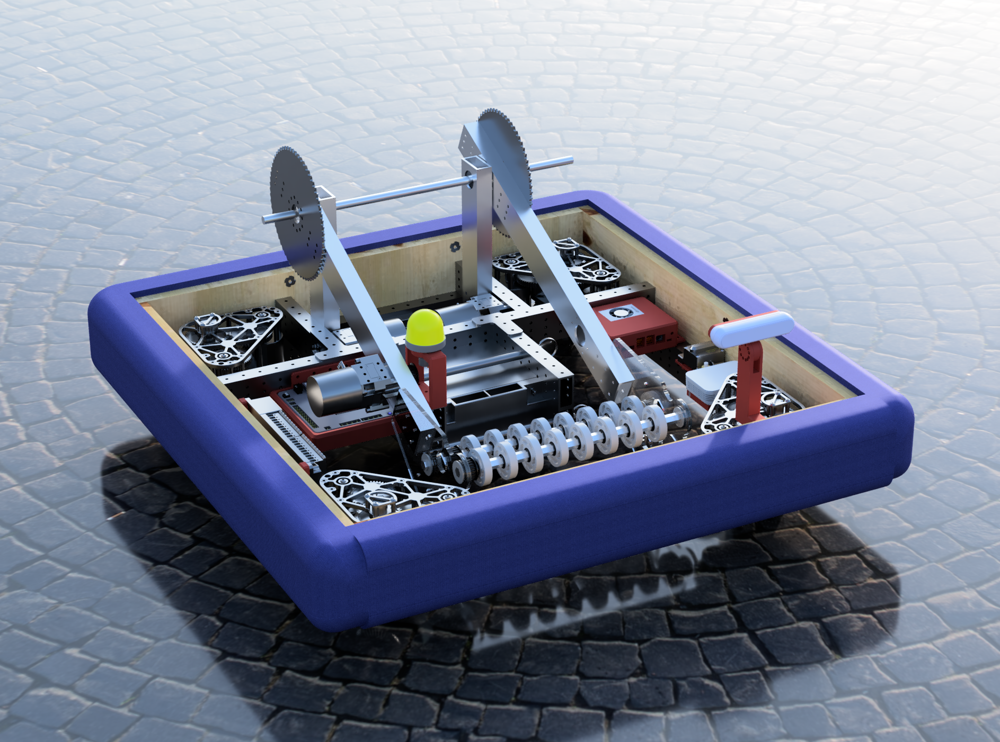

+++
title = 'Crescendo'
+++

## Robot Specs

## Design

## Software

We used a Jetson Orin Nano as a Coprocessor, which allowed us to run multiple vision tasks simultaneously.
This allowed us to run three vision tasks at once

- VSLAM (Visual Simultaneous Localization and Mapping)
- Object Detection
- April Tags

We used [ROS 2 (Robot Operating System 2)](https://www.ros.org/) to run the software on the Orin nano.
All the vision tasks were run in separate nodes, and we used ROS 2's "topics" feature to gather all the data in our custom node.
We fused the April Tags and VSLAM with a Kalman Filter to get a more accurate position of the robot.
The Orin Nano was connected to the RoboRIO via Ethernet, and we communicated between the two via a custom UDP protocol.

Due to the high performance requirements,
we used rust for the custom node on the Orin Nano via [Ros2 Rust](https://github.com/ros2-rust/ros2_rust).
The code for that node can be found on [GitHub](https://github.com/Pixelators4014/pixelization_rs).

## Season Members

- Alinda Lau (Outreach/Marketing Lead)
- Alistair Keiller (Captain and Software Lead)
- Ashwin Naren (Software)
- Han Lu (Design)
- Henry Hutchinson (Design)
- Justin Guoji (Fabrication Lead)
- Neel Gadde (Design)
- Veronica Howard (Fabrication)
